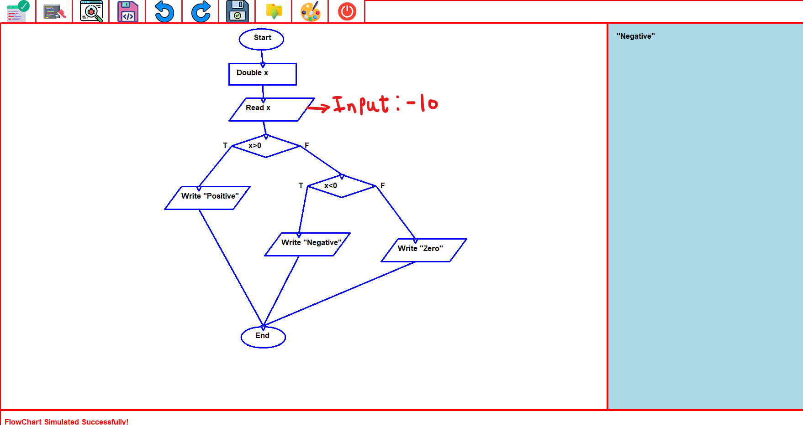

# Flow Chart Simulator

A desktop application for designing and simulating flowcharts using Object-Oriented Programming in C++.  
The system allows users to visually construct algorithms and execute them step-by-step through a graphical interface.

This project was developed as part of the Programming Techniques course at Cairo University.

---

## 🚀 Features

### 🧩 Design Mode
- Add flowchart statements:
  - Start / End
  - Variable Declaration
  - Assignment (value, variable, operator)
  - Conditional (if statements)
  - Input / Output (Read / Write)
- Connect statements using directional connectors
- Select, edit, and delete statements or connectors
- Copy, cut, and paste statements
- Save flowcharts to file
- Load flowcharts from file

---

### ▶️ Simulation Mode
- Validate flowchart correctness:
  - Single Start and End
  - Proper connections
  - Correct branching in conditions
  - Variables declared before use
- Execute flowchart logic
- Accept user input during execution
- Display output results in real-time

---

## 🖥️ User Interface

The application includes:
- Toolbar for actions (design & simulation modes)
- Drawing area for flowchart construction
- Status bar for messages
- Output panel for simulation results

> Example output:
> Input: -10 → Output: "Negative"

---

## 🛠️ Tech Stack

- **Language:** C++  
- **Paradigm:** Object-Oriented Programming (OOP)  
- **Graphics:** Custom GUI library (provided by course framework)

---

## 🧠 System Architecture

The project follows a structured OOP design:

### Core Classes

- **ApplicationManager**
  - Controls the entire application
  - Manages statements and connectors

- **Statement (Base Class)**
  - Parent for all statement types
  - Uses polymorphism for drawing, saving, and execution

- **Connector**
  - Represents edges between statements

- **Action (Base Class)**
  - Each user operation is implemented as a separate action class

- **Input / Output**
  - Handle all GUI interactions
  - No direct console I/O

---

## ⚙️ How It Works

### Design Phase
1. User creates statements visually
2. Connects them to form a logical flow
3. System stores them as a graph (nodes + edges)

### Simulation Phase
1. Flowchart is validated
2. Execution starts from the Start node
3. The system traverses the flowchart:
   - Evaluates conditions
   - Updates variables
   - Handles input/output
4. Results are displayed in the output panel

---

## 💾 File Saving Format

Flowcharts are saved as text files containing:
- List of statements (type, ID, position, logic)
- List of connectors (source, destination, branch)

This allows:
- Reloading saved diagrams
- Reconstructing full flowcharts

---

## 📂 Example Use Case

A flowchart that:
- Reads a number
- Checks if it is:
  - Positive → prints "Positive"
  - Negative → prints "Negative"
  - Zero → prints "Zero"

Example diagram:

---

## 🔮 Future Improvements

- Step-by-step debugging mode
- Export flowcharts as images
- Enhanced UI/UX
- Support for loops and advanced structures

---

## 👤 Author

**Yousuf Gabr**  
- GitHub: https://github.com/YousufGabr  
- LinkedIn: https://www.linkedin.com/in/yousufgabr/

---

## ⭐ Notes

- Undo/Redo and C++ code generation were part of optional features but are not implemented.
- The project strictly follows OOP principles including encapsulation, inheritance, and polymorphism.

---

## ⭐ Support

If you like this project, give it a star ⭐
